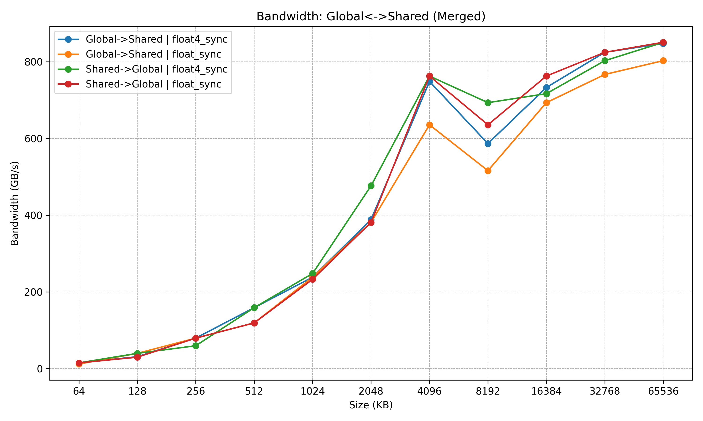
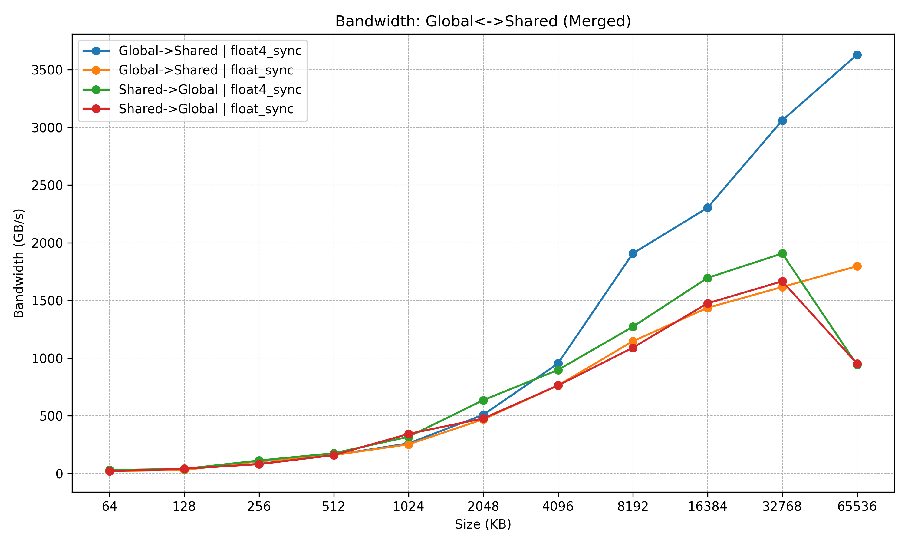
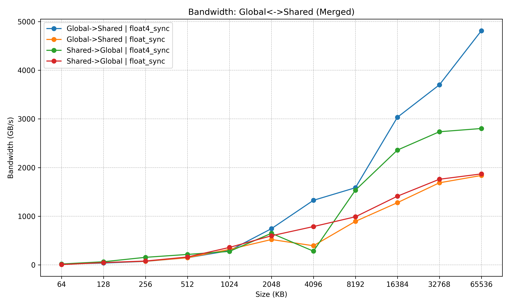
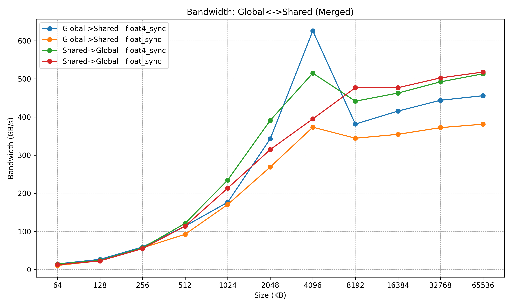
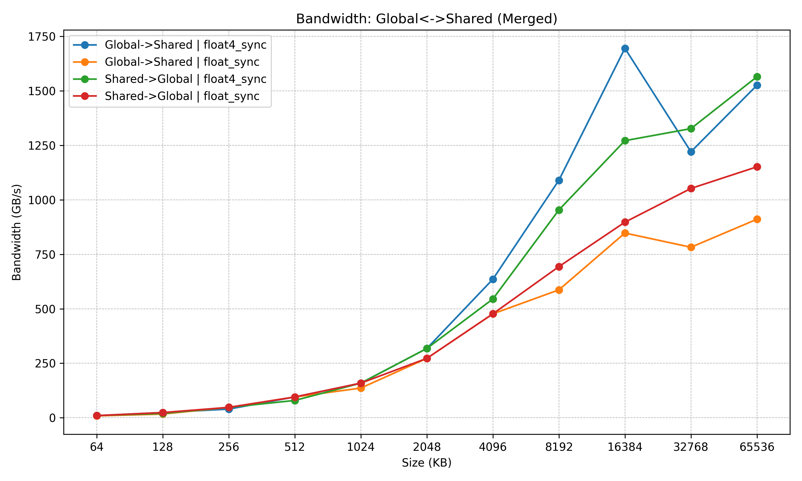

# bandwidth-test

CUDA microbenchmarks for measuring bandwidth between global memory and shared memory, plus a Python plotting utility for generating PNG/PDF figures.

## What is included

- `global2shared.cu`: benchmarks global -> shared copies (`float`, `float4`).
- `shared2global.cu`: benchmarks shared -> global copies (`float`, `float4`).
- `plot.py`: merges CSV outputs and generates plots.
- GPU result folders (`3090/`, `4090/`, `5090/`, `Titan/`, `a100/`) with sample outputs.

## Requirements

- NVIDIA GPU with CUDA support
- CUDA toolkit + `nvcc`
- CMake >= 3.18
- Python >= 3.9

## Build

```bash
cmake -S . -B build -DCMAKE_BUILD_TYPE=Release
cmake --build build -j
```

## Run benchmark binaries

The binaries write fixed filenames:

- `global_to_shared_async_constexpr.csv`
- `shared_to_global.csv`

Run them from a result directory to keep outputs organized:

```bash
mkdir -p results
cd results
../build/global2shared
../build/shared2global
cd ..
```

## Generate plots

Install Python dependencies (choose one):

```bash
uv sync
```

or

```bash
python -m pip install -e .
```

Then render plots from benchmark CSVs:

```bash
python plot.py --input-dir results --output-dir results
```

This creates:

- `results/png/` (PNG plots)
- `results/pdf/` (PDF plots)
- `results/csv/plot_data.csv` (combined data)

## Existing result plots

### Merged bandwidth plots

| GPU | Plot |
| --- | --- |
| RTX 3090 |  |
| RTX 4090 |  |
| RTX 5090 |  |
| Titan |  |
| A100 |  |

## Notes

- `plot.py` defaults to reading `global_to_shared_async_constexpr.csv` and `shared_to_global.csv` from `--input-dir`.
- CUDA architecture selection is handled in `CMakeLists.txt` (`native` when supported by CMake).
